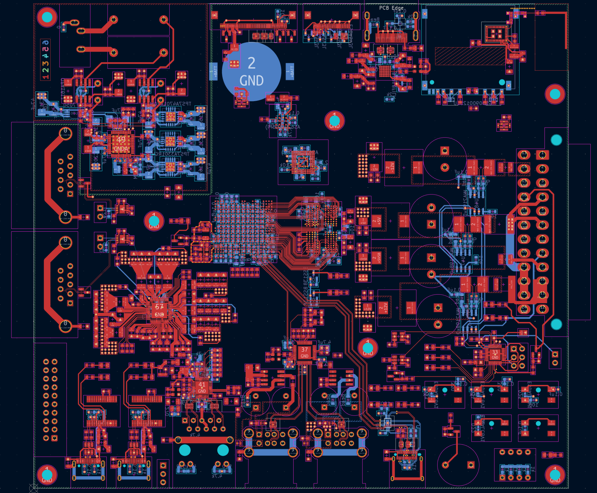
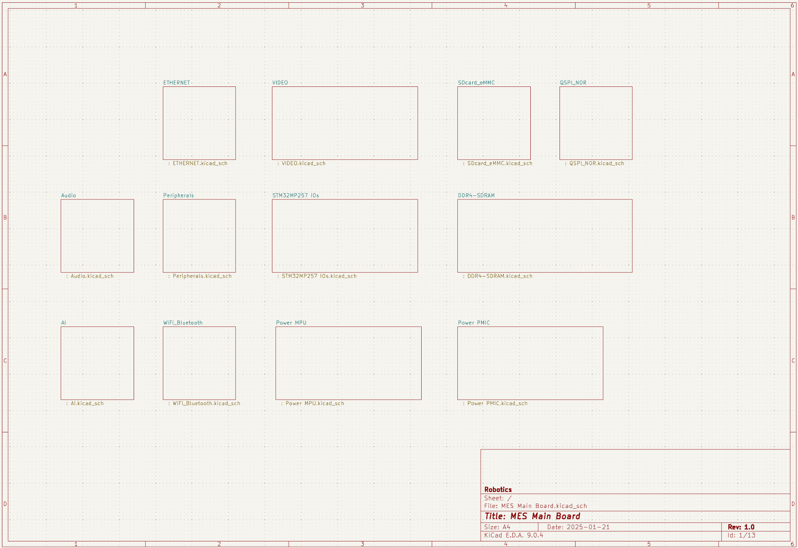
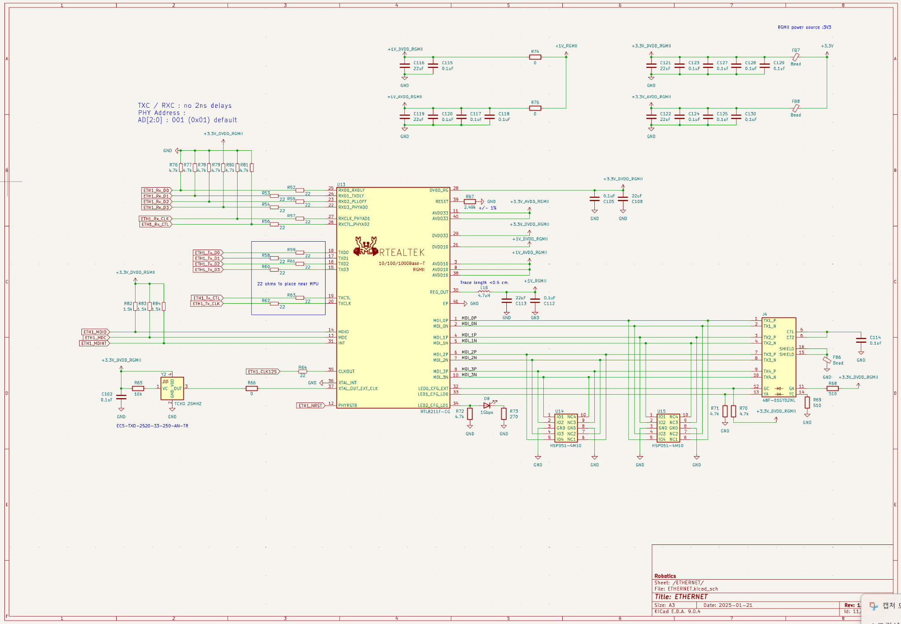
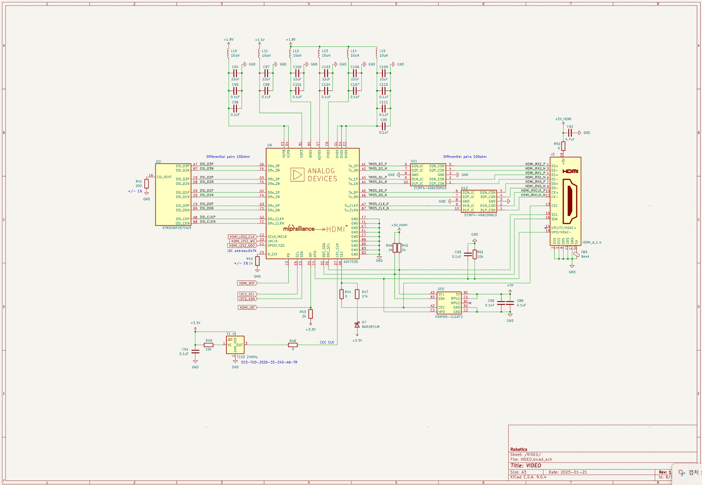
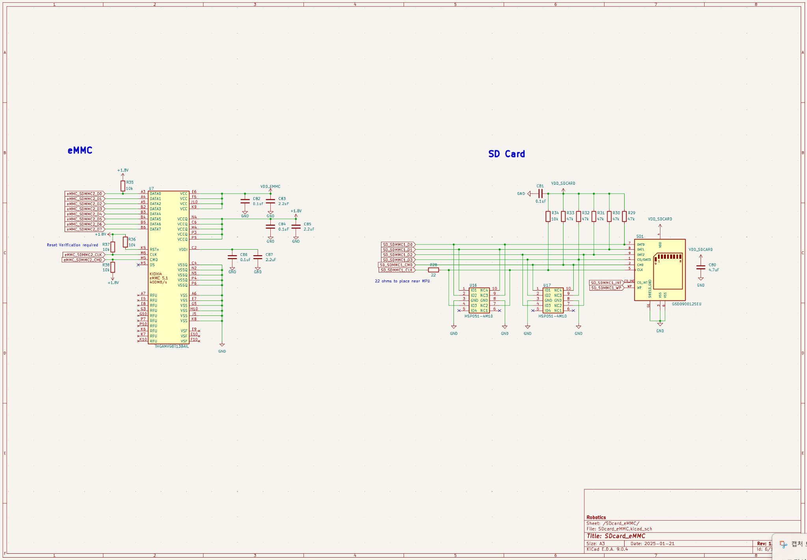
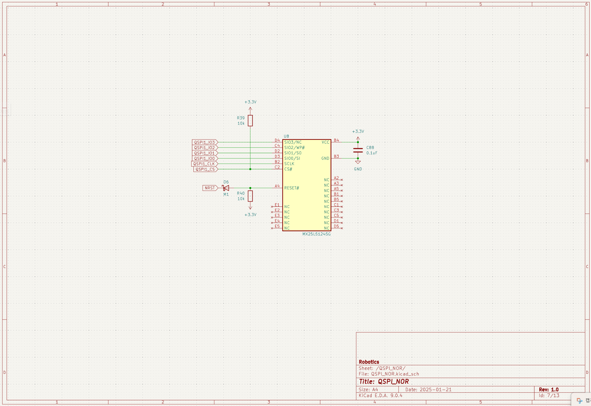
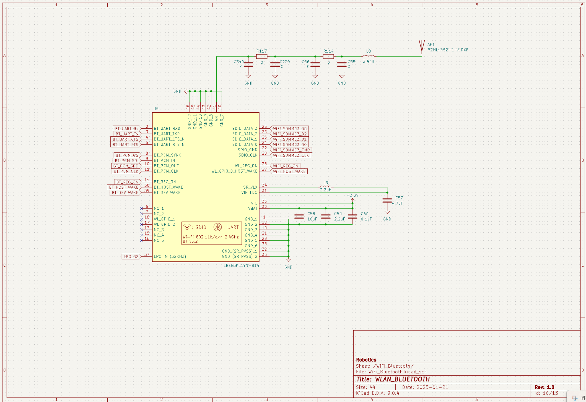
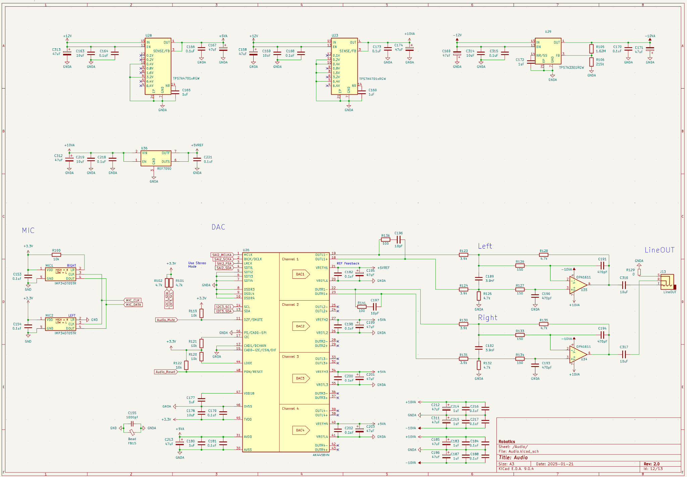
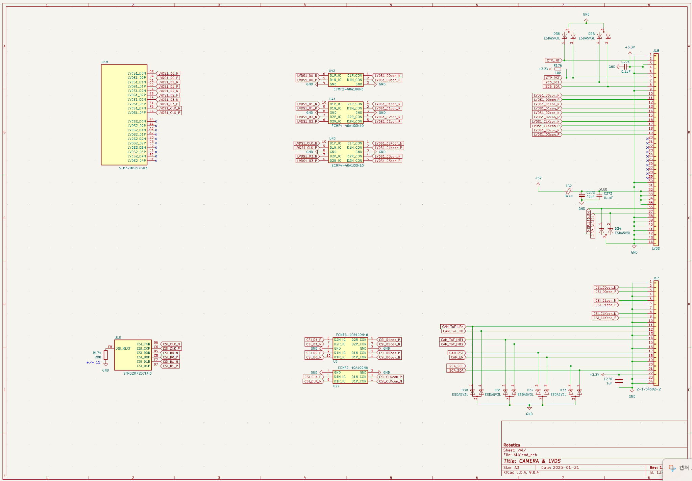

    # MES Main Board (Rev 1.0)

    고성능 MPU **STM32MP257** 기반의 임베디드 메인보드입니다. DSI→HDMI, GbE, Wi‑Fi/BT, eMMC/µSD/QSPI, USB 허브, CAN‑FD, 하이파이 오디오 등 다수의 주변장치를 하나의 보드에 통합하였습니다. 전원은 **ATX‑24**로부터 공급되며, 보조 MCU **ATmega328P**가 ‘SoftKill Power’ 시퀀스를 통해 안전한 전원 관리와 강제 종료 로깅을 수행합니다.

    

    ---

    ## 1. 주요 사양

    - **MPU**: STM32MP257FAI3 (Cortex‑A35 듀얼 + M33)
    - **메모리/부트**: Micron **LPDDR4 4 Gb**(MT53E1G32D2FW‑046), **KIOXIA eMMC (THGAMVG8T13BAIL)**, **QSPI‑NOR (MX25L51245G)**, microSD
    - **네트워킹**: **RTL8211F‑CG Gigabit PHY** + **48F‑01GYD2NL MagJack**
    - **무선**: **Murata LBEE5KL1YN‑814** (802.11b/g/n, BT v5.2)
    - **비디오/디스플레이**: **ADV7535 (MIPI‑DSI → HDMI)**, LVDS 커넥터
    - **USB**: **USB2514B** 허브, USB‑C(2계통: A35/M33), USB 3.0 Type‑A, Stacked USB‑A
    - **필드버스**: **CAN‑FD 트랜시버 MCP2562FD ×2**
    - **오디오**: **AK4458VN(8ch DAC)** + **OPA1611**, 저노이즈 ±전원 **TPS7A4701 / TPS7A3301**
    - **전원/시퀀싱**: **STPMIC25**, 입력 **ATX‑24**

    부품 상세는 `docs/mes_key_components.csv`를 참고하십시오.

    ---

    ## 2. 시스템 개요

    - **스토리지 계층**: QSPI‑NOR(부트로더) → eMMC(루트 파일시스템) + microSD(리커버리/펌웨어 업데이트)
    - **그래픽 파이프라인**: MIPI‑DSI 출력을 ADV7535로 변환하여 HDMI 1.4 인터페이스 제공(DDC/EDID/HPD/CEC 지원)
    - **네트워크**: RGMII 인터페이스 기반 1 GbE, PHY는 RTL8211F‑CG
    - **무선 통신**: SDIO 4‑bit + UART/PCM, 40 MHz TCXO 및 안테나 π‑네트워크 적용
    - **오디오 체인**: AK4458 → OPA1611 버퍼/필터 → Line‑out, ±레일 저노이즈 LDO로 SNR/THD 최적화
    - **필드버스**: MCP2562FD 기반 CAN‑FD 2채널, 보호소자(ESDCAN24‑2BLY) 배치

    ---

    ## 3. SoftKill Power (ATmega328P)

    **공급원**: ATX‑24. 보조 MCU **ATmega328P**가 PSU의 **PS_ON#** 및 **PWR_OK**를 제어·감시하며 안전 시퀀스를 수행합니다.

    ### 3.1 정상 시퀀스
    - **Power On**: 사용자가 Power SW를 누르면 ATmega가 PS를 켜고 **PWR_OK** 확인 후 **MPU_WakeUP** 신호를 인가합니다.
    - **Power Down**: Power SW 또는 GUI의 “전원 끄기”를 트리거로 ATmega가 **종료 요청**을 MPU에 전달 → MPU는 모듈별 종료를 수행하고 ‘꺼도 좋음’ 신호를 회신 → ATmega가 전원을 차단합니다.

    ### 3.2 강제 종료
    - **조건**: Power SW를 **n초 이상** 누름
    - **동작**: ATmega가 **강제종료 이벤트**를 **EEPROM**에 기록하고 MPU로 이벤트 전송
      - **MPU 응답**: 최대 n초까지 모듈 종료 대기 → MPU가 ‘Shut‑OK’ 회신 시 차단
      - **MPU 무응답**: 즉시 전원 차단

    ### 3.3 ATmega 리셋
    1) **AC 코드 분리**  2) **JP1 쇼트**

    ---

    ## 4. Bring‑up 권장 절차

    1) **전원/시퀀스**: STPMIC25 레일 타이밍과 리플 측정, ATX 입력 보호 확인  
    2) **LPDDR4**: TF‑A/U‑Boot에서 training 로그 확인, `memtester`로 스트레스 테스트  
    3) **부트체인**: QSPI‑NOR → eMMC 부팅 확인, microSD 리커버리 경로 검증  
    4) **Ethernet**: RGMII 타이밍/strap, `iperf3` 스루풋 측정  
    5) **Display**: ADV7535 EDID/HPD/CEC 확인 후 720p→1080p  
    6) **Wi‑Fi/BT**: SDIO 25/50 MHz 단계 검증, NVRAM/FW 로딩  
    7) **USB 허브**: 포트별 Enumerate 및 전류 제한/ESD 확인  
    8) **CAN‑FD**: 루프백/피어 통신(500 kbps/2 Mbps)  
    9) **Audio**: I²S/TDM 클록 정합, 라인아웃 SNR/THD 측정

    ---

    ## 5. Linux 디바이스트리 체크리스트

    - `st,stm32mp25` SoC, **stpmic25** 레일/시퀀스
    - **qspi**(mx25l51245g), **mmc0**(eMMC HS200/HS400), **mmc1**(µSD UHS‑I)
    - **mipi‑dsi + adv7535**(cec/hpd/ddc), **ethernet**(rgmii + rtl8211f)
    - **sdio‑wifi**(LBEE5KL1YN‑814), **bt‑uart/pcm**
    - **usb2514b** 허브, Type‑C CC/role(필요 시)
    - **can‑fd**(mcp2562fd), **audio**(ak4458 + i2s/tdm)
    - 보조 MCU(**atmega328p**) 연결(UART/I²C/SPI) 노드

    ---

    ## 6. 이미지

    **PCB Layout**  
    

    **Top‑level 스키매틱**  
    

    **Ethernet / Video / Storage**  
    
    
    
    

    **Wi‑Fi/BT / Audio / LVDS‑Camera**  
    
    
    

    **PMIC / MPU Power / DDR**  
    
    
    

    ---
