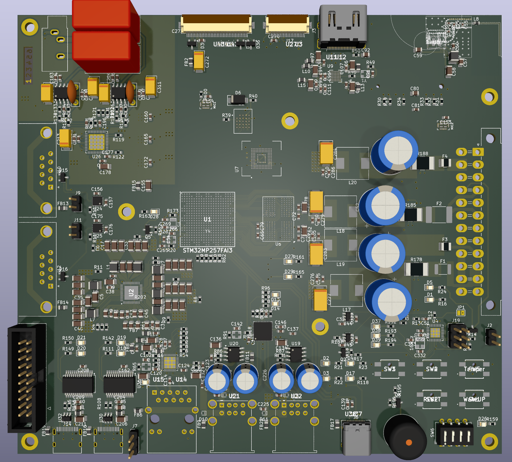

# MES Main Board (Rev 1.0)

STM32MP257 기반 임베디드 메인보드. DSI→HDMI, GbE, Wi-Fi/BT, eMMC/µSD/QSPI, USB 허브, CAN-FD, 하이파이 오디오 체인을 단일 보드에 통합하였다. 전원은 ATX-24로부터 공급되며, 보조 MCU ATmega328P가 “SoftKill Power” 시퀀스를 통해 안전한 전원 관리와 강제 종료 로깅을 담당한다.

---

## 1. 핵심 사양

- **MPU**: ST **STM32MP257FAI3** (Cortex-A35 듀얼 + Cortex-M33)
- **메모리/부트**
  - LPDDR4: **Micron MT53E1G32D2FW-046**
  - eMMC: **KIOXIA THGAMVG8T13BAIL**
  - QSPI-NOR: **Macronix MX25L51245G**
  - microSD: **GSD090012SEU**
- **네트워킹**
  - Gigabit PHY: **Realtek RTL8211F-CG**
  - MagJack: **48F-01GYD2NL**
- **무선**: **Murata LBEE5KL1YN-814** (802.11b/g/n, BT v5.2, SDIO + UART/PCM)
- **비디오/디스플레이**
  - **Analog Devices ADV7535** (MIPI-DSI → HDMI 1.4)
  - HDMI ESD 보호: **HDMI05-CL02F3**
  - LVDS 패널 커넥터 제공
- **USB**
  - **Microchip USB2514B** 4-포트 USB 2.0 허브
  - USB-C(2계통: A35 경로 / M33 경로), USB 3.0 Type-A, Stacked USB-A
- **필드버스**: **MCP2562FD** CAN-FD 트랜시버 ×2, ESDCAN 보호소자
- **오디오 체인**
  - DAC: **AK4458VN**(8채널)
  - Op-Amp: **OPA1611**
  - 저노이즈 LDO: **TPS7A4701 / TPS7A3301**(±전원)
- **전원/시퀀싱**
  - PMIC: **STPMIC25**
  - 입력: **ATX-24**
- **클록**: 24/25/40 MHz TCXO, 32.768 kHz RTC, 16 MHz(ATmega)

부품 요약 CSV: `docs/mes_key_components.csv`

---

## 2. 시스템 구성 개요

- **스토리지 계층**: QSPI-NOR(부트로더) → eMMC(루트 파일시스템) + microSD(리커버리/업데이트)
- **그래픽 파이프라인**: MPU MIPI-DSI → ADV7535 변환 → HDMI(DDC/EDID/HPD/CEC)
- **네트워크**: RGMII 기반 1 GbE(Phy RTL8211F-CG + MagJack)
- **무선**: SDIO 4-bit + LPO/WAKE, 40 MHz TCXO, 안테나 π-네트워크
- **오디오**: AK4458 → OPA1611(Line-out), ±레일 저노이즈 LDO로 SNR/THD 최적화
- **필드버스**: MCP2562FD ×2, 종단 저항/보호소자 구성

이미지 참조:
- 레이아웃: `docs/images/pcb-layout.png`
- 탑레벨 스키매틱: `docs/images/schematic-overview.png`
- Ethernet/Video/Storage/Wi-Fi/Audio/PMIC/DDR 등: `docs/images/` 하위 파일

---

## 3. SoftKill Power (ATmega328P)

전원은 **ATX-24**에서 입력되며, 보조 MCU **ATmega328P**가 PSU의 **PS_ON#**과 **PWR_OK**를 제어·감시한다.

### 3.1 정상 동작 시퀀스
1. **Power On**: 사용자가 Power SW를 누르면 ATmega가 PS_ON#을 구동하여 PSU를 켬 → **PWR_OK** 감시 → **MPU_WakeUP** 신호 출력.
2. **Power Down**: Power SW 또는 GUI의 “전원 끄기” → ATmega가 **종료 요청**을 MPU에 전달 → MPU가 모듈별 종료를 수행하고 ‘Shut-OK’ 회신 → ATmega가 전원 차단.

### 3.2 강제 종료 시퀀스
- **조건**: Power SW를 **n초 이상** 지속 입력.
- **처리**
  - ATmega가 **강제종료 이벤트**를 **EEPROM**에 기록하고 MPU에 이벤트 통보.
  - **MPU 응답**: 최대 n초 동안 모듈 종료 대기 → MPU의 ‘Shut-OK’ 수신 시 전원 차단(시간 초과 시에도 차단).
  - **MPU 무응답**: 즉시 전원 차단.

### 3.3 ATmega 리셋 방법
1) AC 코드 분리  2) **JP1 쇼트**로 하드 리셋.

---

## 4. Bring-up 절차(권장)

1. **전원/시퀀스**: STPMIC25 레일 타이밍·리플 측정, ATX 입력 보호/서지 경로 확인.
2. **LPDDR4**: TF-A/U-Boot에서 training 로그 확인, `memtester`로 장시간 스트레스.
3. **부트체인**: QSPI-NOR → eMMC 부팅 확인, microSD 리커버리 경로 검증.
4. **Ethernet**: RGMII 타이밍/strap, MDIO 주소 확인, `iperf3` 스루풋 측정.
5. **Display**: ADV7535 I²C 접근, EDID/HPD/CEC 정상 → 720p → 1080p 순으로 검증.
6. **Wi-Fi/BT**: SDIO 25/50 MHz 단계 bring-up, NVRAM/FW 로딩, 안테나 VSWR 체크.
7. **USB 허브**: USB2514B enumerate, 각 포트 전류 한계/ESD 보호 확인.
8. **CAN-FD**: 루프백/피어 통신(500 kbps/2 Mbps), 종단 저항 설정 검증.
9. **Audio**: I²S/TDM 클록(256fs/512fs) 정합, 라인아웃 SNR/THD 측정.

---

## 5. Linux 디바이스트리 체크리스트

- SoC: `st,stm32mp25` / PMIC: `st,stpmic25`(레일/시퀀스/IRQ)
- QSPI NOR: `mx25l51245g` (bootloader/MTD 파티션)
- MMC: `mmc0`=eMMC(HS200/HS400), `mmc1`=µSD(UHS-I)
- MIPI-DSI + `adv7535`(HPD/CEC/DDC)
- Ethernet: RGMII + `realtek,rtl8211f` PHY 노드
- Wi-Fi/BT: SDIO(LBEE5KL1YN-814), BT UART/PCM, 32 kHz LPO
- USB: root hub + `microchip,usb2514b`(리셋 GPIO 있으면 명시), Type-C CC/role
- CAN-FD: `mcp2562fd` enable/standby GPIO
- Audio: `ak4458` codec, I²S/TDM DAI-link
- ATmega328P: 보조 MCU 인터페이스(UART/I²C/SPI) 노드

---

## 6. 파일/이미지 배치 가이드
├─ README.md
└─ docs/
├─ mes_key_components.csv # 핵심 부품 요약 (선택)
└─ images/
├─ hero-3d-top.png
├─ pcb-layout.png
├─ schematic-overview.png
├─ schematic-ethernet.png
├─ schematic-video.png
├─ schematic-sd-emmc.png
├─ schematic-qspi.png
├─ schematic-wifi-bt.png
├─ schematic-audio.png
├─ schematic-lvds-camera.png
├─ schematic-pmic.png
├─ schematic-mpu-power.png
└─ schematic-ddr.png
